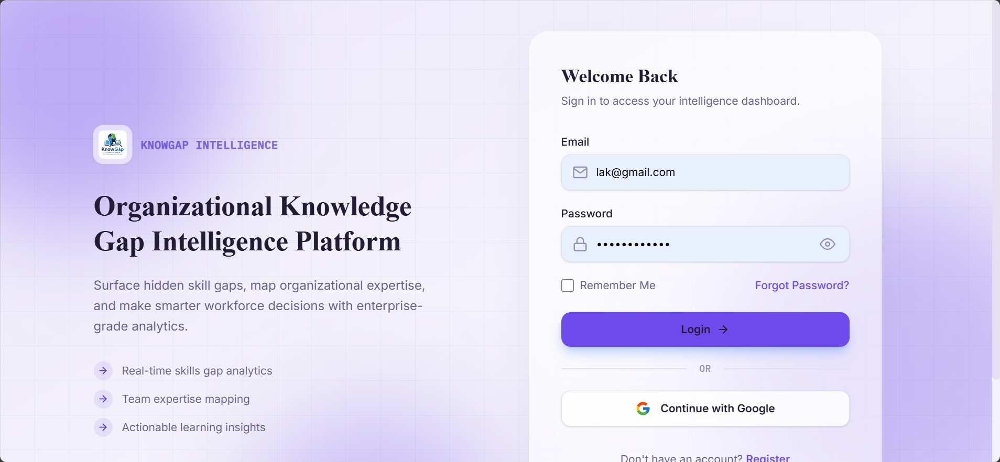
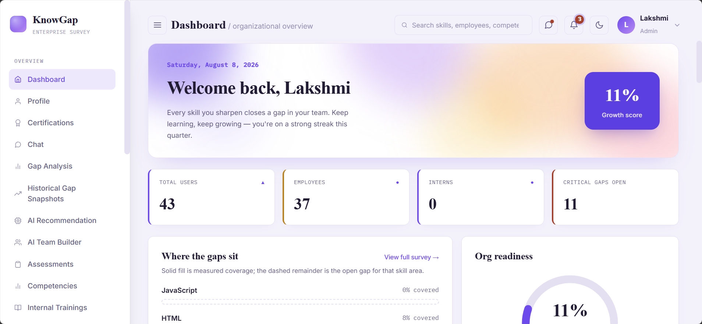
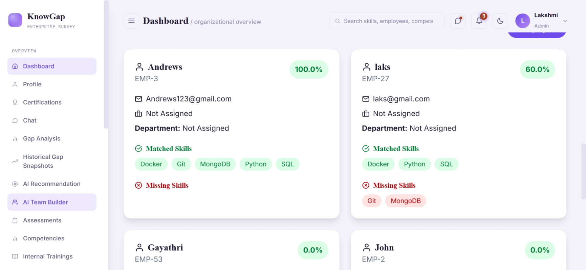
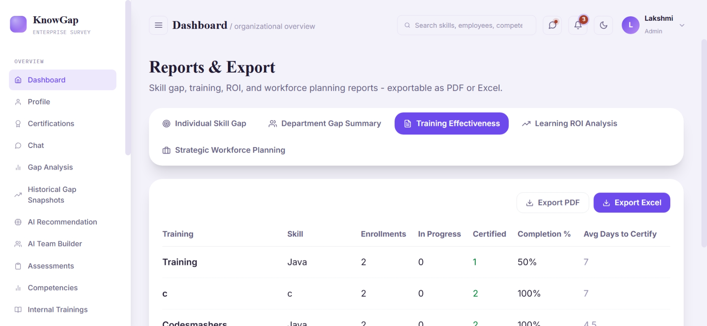
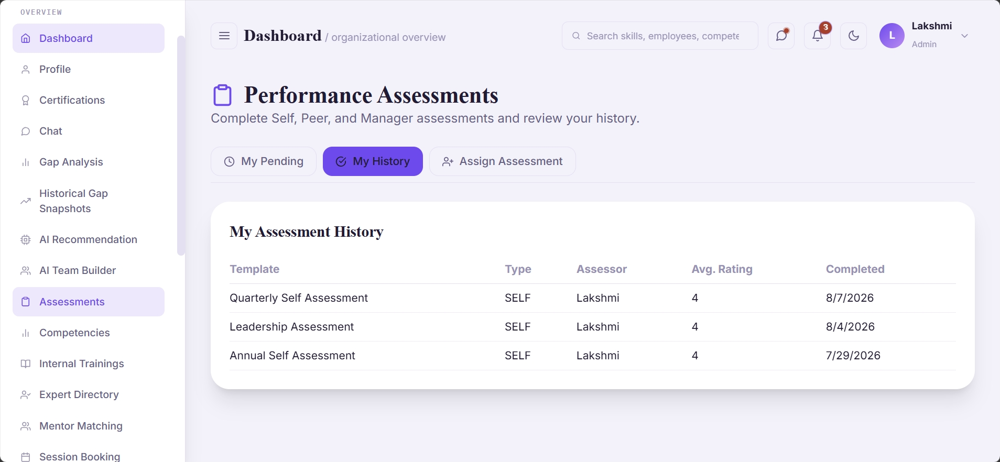
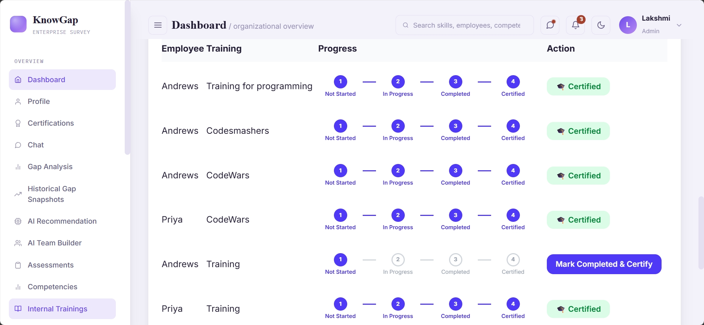

# KnowGap — Organizational Knowledge Gap Intelligence Platform

A full-stack enterprise platform that helps organizations track employee skills, map the skills required for each role, and surface skill gaps across the workforce — so managers can spot training needs and plan upskilling with data instead of guesswork.


---

## Table of Contents

- [Overview](#overview)
- [Features](#features)
- [Screenshots](#screenshots)
- [Tech Stack](#tech-stack)
- [Project Structure](#project-structure)
- [Prerequisites](#prerequisites)
- [Setup & Installation](#setup--installation)
  - [Backend Setup](#1-backend-setup)
  - [Frontend Setup](#2-frontend-setup)
- [Environment Variables](#environment-variables)
- [API Overview](#api-overview)
- [Security Notes](#security-notes)
- [Contributing](#contributing)
- [License](#license)

---

## Overview

KnowGap gives HR and engineering leaders a single source of truth for **who knows what** across the organization. Admins define the skills required for each role, employees maintain their own skill profiles, and the platform automatically calculates a **gap percentage** per employee and per team — surfaced through dashboards, heatmaps, and exportable reports.

## Features

| Area | What it does |
|---|---|
| **Authentication & Authorization** | Register/login with JWT, Google OAuth2 login, OTP verification, and role-based access control (Admin / Employee) |
| **Forgot / Reset Password** | Secure, token-based reset flow delivered via email, with token expiry and single-use enforcement |
| **Employee Management** | View and manage employee profiles |
| **Skill Management** | Create, update, and manage the master list of skills |
| **Employee–Skill Mapping** | Assign skills (with proficiency level) to individual employees |
| **Role–Skill Mapping** | Admins define which skills are required for each role |
| **Gap Analysis** | Compares an employee's actual skills against their role's required skills — calculates a gap % and lists missing skills |
| **Dashboard & Heatmap** | Aggregated org-wide stats and a skill-gap heatmap |
| **AI Recommendations** | Personalized skill/learning recommendations per user |
| **AI Team Builder** | Matches employees to project/team requirements based on skill coverage |
| **Assessments** | Self, peer, and manager performance assessments with history tracking |
| **Internal Trainings** | Track enrollment, progress, and certification for internal training programs |
| **Reports & Export** | Skill gap, training effectiveness, ROI, and workforce planning reports — exportable as PDF or Excel |
| **User Profile Management** | View/update profile details and change password |

## Screenshots

<table>
<tr>
<td width="50%">

**Login**


</td>
<td width="50%">

**Dashboard — Organizational Overview**


</td>
</tr>
<tr>
<td width="50%">

**AI Team Builder**


</td>
<td width="50%">

**Reports & Export**


</td>
</tr>
<tr>
<td width="50%">

**Performance Assessments**


</td>
<td width="50%">

**Internal Trainings**


</td>
</tr>
</table>

## Tech Stack

**Backend**
- Java 17+, Spring Boot 3.5
- Spring Web, Spring Data JPA, Spring Security, Spring Validation
- Spring OAuth2 Client (Google login)
- Spring Mail (password reset emails)
- JWT (jjwt) for stateless authentication
- PostgreSQL
- Lombok

**Frontend**
- React 19 + Vite
- React Router
- Axios
- Tailwind CSS
- Recharts (dashboard & heatmap visualizations)
- React Icons

## Project Structure

```
organizational-knowledge-gap-intelligence-platform/
├── src/main/java/com/organizational/knowledge_gap_platform/
│   ├── config/          # CORS config, initial role data seeding
│   ├── controller/      # REST controllers (Auth, Employee, Skill, Role, GapAnalysis, ...)
│   ├── dto/              # Request/response data transfer objects
│   ├── entity/           # JPA entities (User, Employee, Skill, Role, ...)
│   ├── exception/        # Custom exceptions + global exception handler
│   ├── repository/       # Spring Data JPA repositories
│   ├── security/         # JWT filter/service, OAuth2 handlers, security config
│   └── service/          # Business logic
├── src/main/resources/
│   ├── application.properties
│   └── application-local.properties   # local-only secrets (gitignored)
├── docs/
│   └── screenshots/       # README screenshots
└── frontend/
    ├── src/
    │   ├── api/           # fetch-based API calls (e.g. auth)
    │   ├── services/      # axios-based API calls (roles, skills, employees, ...)
    │   ├── pages/          # route-level pages (Login, Dashboard, RoleSkillMapping, ...)
    │   └── components/    # shared/reusable UI components
    └── package.json
```

## Prerequisites

- Java 17+ and Maven
- Node.js 18+ and npm
- PostgreSQL (running locally or accessible remotely)
- A Gmail account with an App Password (for sending password reset emails)
- A Google Cloud OAuth2 Client ID/Secret (for Google login)

## Setup & Installation

### 1. Backend Setup

**Create a PostgreSQL database:**

```sql
CREATE DATABASE knowledge_gap_platform;
```

**Configure local secrets** in `src/main/resources/application-local.properties` (already gitignored, so it's safe to put secrets here):

```properties
jwt.secret=your-local-jwt-secret
```

**Set the required environment variables** before running the app (see [Environment Variables](#environment-variables) below).

On Linux/macOS:

```bash
export MAIL_USERNAME=your-email@gmail.com
export MAIL_PASSWORD=your-gmail-app-password
export JWT_SECRET=your-jwt-secret
export GOOGLE_CLIENT_ID=your-google-client-id
export GOOGLE_CLIENT_SECRET=your-google-client-secret
```

On Windows (PowerShell):

```powershell
$env:MAIL_USERNAME="your-email@gmail.com"
$env:MAIL_PASSWORD="your-gmail-app-password"
$env:JWT_SECRET="your-jwt-secret"
$env:GOOGLE_CLIENT_ID="your-google-client-id"
$env:GOOGLE_CLIENT_SECRET="your-google-client-secret"
```

Also update the datasource credentials in `application.properties` to match your local PostgreSQL setup (`spring.datasource.username` / `spring.datasource.password`).

**Run the backend:**

```bash
./mvnw spring-boot:run
```

The API will start on `http://localhost:8080`. Tables are auto-created/updated via `spring.jpa.hibernate.ddl-auto=update`.

### 2. Frontend Setup

```bash
cd frontend
npm install
```

Confirm/update `frontend/.env`:

```env
VITE_API_ORIGIN=http://localhost:8080
VITE_API_URL=http://localhost:8080/auth
VITE_API_BASE_URL=http://localhost:8080
```

Start the dev server:

```bash
npm run dev
```

The app will be available at `http://localhost:5173`.

## Environment Variables

| Variable | Used By | Purpose |
|---|---|---|
| `MAIL_USERNAME` | Backend | Gmail address used to send password reset emails |
| `MAIL_PASSWORD` | Backend | Gmail App Password (not your regular Gmail password) |
| `JWT_SECRET` | Backend | Secret key used to sign/verify JWT tokens |
| `GOOGLE_CLIENT_ID` / `GOOGLE_CLIENT_SECRET` | Backend | Google OAuth2 login credentials |
| `FAST2SMS_API_KEY` | Backend | API key for OTP SMS delivery (optional, defaults to a dummy key) |
| `FRONTEND_RESET_URL` | Backend | Frontend URL the password reset email links to (defaults to `http://localhost:5173/reset-password`) |
| `OAUTH2_REDIRECT_URI` / `OAUTH2_FAILURE_REDIRECT_URI` | Backend | Where to redirect after OAuth2 login success/failure |
| `VITE_API_BASE_URL` | Frontend | Base URL of the backend API |

## API Overview

All endpoints are prefixed as shown below and generally require a JWT bearer token unless noted otherwise.

| Area | Base Path | Notes |
|---|---|---|
| Auth | `/auth` | Register, login, roles list, OTP send/verify — public |
| Password Reset | `/api/auth/forgot-password`, `/api/auth/reset-password` | Public |
| Users | `/api/users` | Authenticated |
| Admin | `/api/admin` | Assign roles to users — Admin only |
| Employees | `/api/employees` | Employee records |
| Employee Skills | `/api/employees/{employeeId}/skills` | Assign/update/view an employee's skills |
| Skills | `/api/skills` | Manage the master skill list |
| Roles | `/api/roles` | Manage roles, assign roles to users, role details |
| Role–Skill Mapping | `/api/roles/{roleId}/skills`, `/api/roles/skills/all` | Admin-only — define required skills per role |
| Gap Analysis | `/api/gap-analysis/employee/{employeeId}`, `/api/gap-analysis/employee/{employeeId}/role/{roleId}` | Compare employee skills vs. role requirements |
| Dashboard | `/api/dashboard/stats`, `/api/dashboard/skill-gap-heatmap` | Aggregated analytics |
| Recommendations | `/api/recommendation/{userId}` | Personalized suggestions |
| Profile | `/api/profile/{userId}` | View/update profile, change password |

## Security Notes

- Password reset tokens are hashed (SHA-256) before being stored, and are single-use with a configurable expiry (`app.password-reset.token-expiry-minutes`).
- `src/.env` and `src/main/resources/application-local.properties` are already gitignored — keep real secrets there, not in `application.properties`.

## Contributing

1. Fork the repo and create your branch from `main`: `git checkout -b feature/your-feature-name`
2. Commit your changes with clear, descriptive messages
3. Push to your branch and open a pull request

